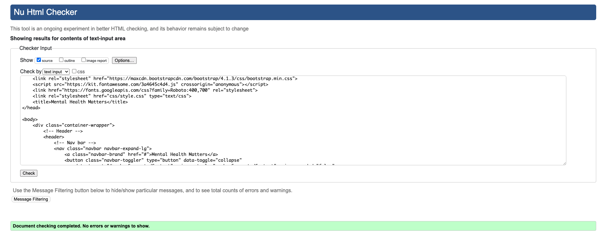
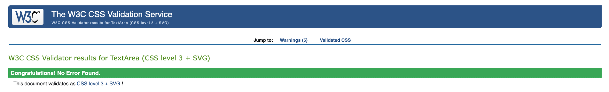

# Portfolio Project - Mental Health Matters Website

First individual Code Institute project

[Deployed project link](https://els-390.github.io/CI-Portfolio-Project--Mental-Health/)

## Mock Ups

## Overview

### Features

- Nav bar with Logo

- Hero section with positive messaging and call to action

- Information cards on various mental health topics with links provided to external sources for further information.

- Information about relevant events

- Carousel with positive messaging.

- Footer with social media links

## UX 

### The Brief: 

#### Project 4: Mental Health Awareness

##### External User’s Goal:

The user seeks accessible, beginner-friendly information on mental health, including how to recognize common issues and manage stress, presented in a supportive and organised layout.

##### Site Owner’s Goal:

The site owner wants to create a welcoming webpage that provides basic mental health information using a clean and supportive design. The focus is on using HTML and CSS with Bootstrap to create a calming and well-organised user experience.

### Purpose

This project is designed to be a one page resource on Mental Health showcasing HTML, CSS and Bootstrap. The project will provide a resource to help its users to understand what is mental health, why it is important, how to maintain good mental health and where to go to find support.

### Target Audience

The target audience for this website will include: Individuals seeking help for their mental health, health and care providers and professionals, and members of the general public. 

It will be accessible to a wide range of users from different demographics and marginalised communities. 

### Inital Design Thoughts and Ideas

 As this website is to inform users about mental health, why it is important and how to seek support and further information so I would like to include a calming design and colour scheme without lots of dynamic elements and piece of content. 

## Typography

Font decisions based around what is most accessible and clear for users accessing the website and its content from [Google Fonts](https://fonts.google.com/).

 ## Colours and Images 

 Careful selection of colours that contrast but don't detract from the website content or images.
 
 Colours selection from the hero image at the top of the page using  [ColorZilla Chrome Extension](https://chromewebstore.google.com/detail/colorzilla/bhlhnicpbhignbdhedgjhgdocnmhomnp) and refined using [Color Space](https://mycolor.space/gradient3?ori=to+right+top&hex=%23003055&hex2=%2336686E&hex3=%23D5E8E6&submit=submit) to create a colour pallette. 

 

Images sourced from [Unsplash](https://unsplash.com/)
Logos source from [Mental Health Foundation](https://www.mentalhealth.org.uk/), Samaritans(https://www.samaritans.org/) and [The NHS](https://www.nhs.uk/)
NHS.

### Colour pallette

I wanted to use a colour pallette that kept inline with the clean and supportive experience. For that reason I wanted to use a green pallette as that often promote the feelings of renewal, tranquility, growth, and inspiration.

#### Typography

Playfair Display - used for headers as its a stylish serif font that aligns with my concepts of bring a calming experience to the user.

Roboto - used for main bodies of text as it is simple and highly readable emphasising the ease of use. 

Font awesome for any icons used.

## User Stories

**Individuals Seeking Help**

* People with mental health conditions, including those diagnosed with conditions like anxiety, depression, bipolar disorder, schizophrenia, etc.
* Individuals experiencing mental health challenges: People going through difficult times, such as grief, stress, trauma, or substance abuse.
* Family members and caregivers: People supporting individuals with mental health issues.

**Businesses, Professionals and Healthcare Providers**
* Mental health professionals: Therapists, counselors, psychiatrists, social workers, etc.
* Healthcare providers: Doctors, nurses, and other medical professionals.
Educators: Teachers, school counselors, and university faculty.
* Organisations and businesses: Companies looking to promote mental health in the workplace.
* Policymakers and researchers: Individuals involved in shaping mental health policies and conducting research.

**General Public**
* People interested in mental health awareness: Individuals curious about mental health issues and seeking to learn more.

**Specific Demographics**
* Youth and young adults: Students, young professionals, and individuals facing unique challenges.
* Older adults: Seniors experiencing age-related mental health concerns.
Members of marginalized communities: Individuals from diverse backgrounds, including racial and ethnic minorities, LGBTQ+ individuals, and people with disabilities.

## Design Decisions

### Wireframes

### Features 

- Navbar with nav options, drop dowm menu and navbar toggler
- Hero section with background image, positive messaging and CTA 
- Information cards on menu health support information options
- External links to outside sources for further information 
- Carousel of positive quotes/messages
- Footer with social media icons/links

### User Stories

- <b>As a user</b>, I want the website information to be predented in a clear format so it is easy to read and interpret.

- <b>As a user</b>, I want the website to be clearly organised so I can find the relevant information I need easily.

- <b>As a user</b>, I want mobile-friendly access to the website, so I can browse on any device.

- <b>As the site owner</b>, I want the site layout to be simple so users can easily navigate the sections and pages. 

- <b>As the site owner</b>, I want to include resources and external links, so users can access further help if they need it.

- <b>As the site owner</b>, I want the theme to be calming to fit with the theme.

- <b>As the site owner</b>, I want to provide inspiration quotes to motivate the user.

- <b>As the site owner</b>, I want to provide information about relevant key dates and events to inform the user.

#### Must Haves
 1. User friendly information
 - Content clear and concise
 - Easy to use functionality

 2. Responsive mobile-friendly design
- Website displays and functions well on smartphones and other devices
- Responsive design that adapts when viewe on different models and aspect ratios

 3. Clear and organised navigation 
 - Navigation items are clear and intuitive to all users

 #### Should Have
 1. Contrasting but calming colour scheme and design
 - Relevant image for text and feature content
 - ALT tags for all images and icons
 - A range of colours to convey messaging (light, medium, dark)

 2. Clear and simple page layout
 - Utilising simple legible fonts to support content
 - Clear spacing and design throughout

#### Could Have
1. Further reading and resources
- Links opening in new tab to not take users away from site
- Further resources available on site

## Tools and Technologies Used

- HTML5

- CSS3

- [Bootstrap 4.6](https://getbootstrap.com/docs/4.6/getting-started/introduction/)

- Gitpod - Code Institue cloud IDE

- [Font Awesome](fontawesome.com)

- [Google Fonts](fonts.google.com)

- [ColorZilla](https://chromewebstore.google.com/detail/colorzilla/bhlhnicpbhignbdhedgjhg)

- [Unsplash](unsplash.com)

- [Tinypng.com](Tinypng.com)

### Accessibility Considerations

- Utilising contrasting colours for the design and themes
- Adding ALT tags to images and icons
- Ensuring links open in new tabs when clicked

## AI Tools Usage

- Utilised Google Gemini AI tool to research names for the website
- Quote section at the bottom of the website was also provided by ChatGPT and modified by myself using CSS and Bootstrap 4.6

## Testing and Validation

### Testing Results
Summarize the results of testing across different devices and screen sizes.  
Mention any issues found and how they were resolved.  

### Validation
Validation using HTML and CSS using W3C and Jigsaw validators.  

#### HTML Validation: 

For HTML validation https://validator.w3.org/

No issues detected.

#### CSS Validation: 

For CSS validation https://jigsaw.w3.org/css-validator/

No issues detected.

#### Lighthouse

Testing and validation using Lighthouse to determine accessibility, SEO and loading times. 

## Deployment

### Deployment Process

Project successfully deployed to GitHub Pages ly without issues. 

## Reflection on Development Process

### Successes

Effective use of AI tools to help with development process to improve understanding of some features contributed to the development process.

### Challenges

Some challenges with rendering images that are different sizes and orientation when used with Bootstrap cards on the page. Improvements to be made in future iterations.

Some challenges identified within Lighthouse testing to improve loading times and SEO.

### Final Thoughts
Provide any additional insights gained during the project and thoughts on the overall process.  
**Guidance:** Begin drafting reflections during Phase 1 and update throughout the project. Finalize this section after Phase 4. Highlight successes and challenges, particularly regarding the use of AI tools, and provide overall insights into the project.

## Future Improvements

Improvements can be made in future to SEO and with improved image rendering. 

Also some issues with the Quote section at the bottom adjusting as the quotes change.