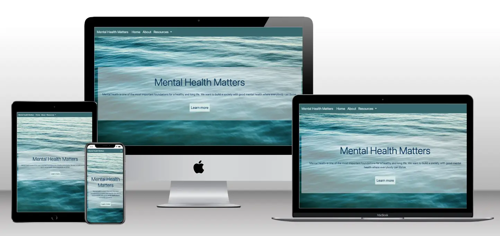
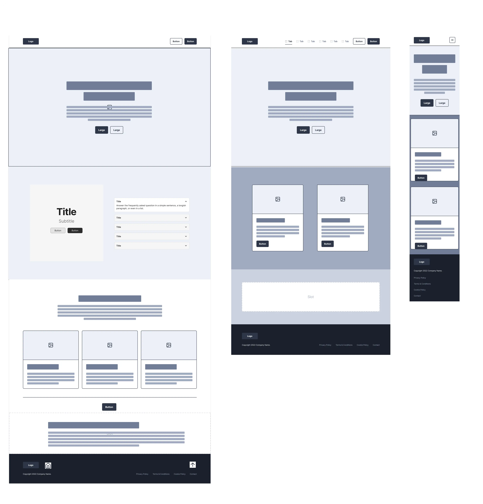

# Portfolio Project - Mental Health Matters Website

First individual Code Institute project

[Deployed project link](https://els-390.github.io/CI-Portfolio-Project--Mental-Health/)

## Mock Ups

## Overview

### The Brief: 

#### Project 4: Mental Health Awareness

##### External User’s Goal:

The user seeks accessible, beginner-friendly information on mental health, including how to recognize common issues and manage stress, presented in a supportive and organised layout.

##### Site Owner’s Goal:

The site owner wants to create a welcoming webpage that provides basic mental health information using a clean and supportive design. The focus is on using HTML and CSS with Bootstrap to create a calming and well-organised user experience.

##### Potential Features might Include:

* Hero Section with Positive Messaging: A Bootstrap Jumbotron with an encouraging message about mental health, using a calming colour scheme and a simple background image.
* Information Cards: Use Bootstrap’s card components to present mental health tips and common issues, providing a visually appealing way to organise content.
* Resource Links: A grid layout for external links to mental health resources, styled with Bootstrap buttons to make them stand out.
* Positive Affirmations: Use Bootstrap’s text utilities to include a section with uplifting quotes or messages to encourage users.

### Purpose

This project is designed to be a one page resource on Mental Health showcasing HTML, CSS and Bootstrap. The project will provide a resource to help its users to understand what is mental health, why it is important, how to maintain good mental health and where to go to find support.

### Target Audience

The target audience for this website will include: Individuals seeking help for their mental health, health and care providers and professionals, and members of the general public. 

It will be accessible to a wide range of users from different demographics and marginalised communities. 

## User Stories

**Individuals Seeking Help**

* People with mental health conditions, including those diagnosed with conditions like anxiety, depression, bipolar disorder, schizophrenia, etc.
* Individuals experiencing mental health challenges: People going through difficult times, such as grief, stress, trauma, or substance abuse.
* Family members and caregivers: People supporting individuals with mental health issues.

**Businesses, Professionals and Healthcare Providers**
* Mental health professionals: Therapists, counselors, psychiatrists, social workers, etc.
* Healthcare providers: Doctors, nurses, and other medical professionals.
Educators: Teachers, school counselors, and university faculty.
* Organisations and businesses: Companies looking to promote mental health in the workplace.
* Policymakers and researchers: Individuals involved in shaping mental health policies and conducting research.

**General Public**
* People interested in mental health awareness: Individuals curious about mental health issues and seeking to learn more.

**Specific Demographics**
* Youth and young adults: Students, young professionals, and individuals facing unique challenges.
* Older adults: Seniors experiencing age-related mental health concerns.
Members of marginalized communities: Individuals from diverse backgrounds, including racial and ethnic minorities, LGBTQ+ individuals, and people with disabilities.

## Design Decisions

### Wireframes

### Features 

- Navbar with nav options, drop dowm menu and navbar toggler
- Hero section with background image, positive messaging and CTA 
- Information cards on menu health support information options
- External links to outside sources for further information 
- Carousel of positive quotes/messages
- Footer with social media icons/links

#### Must Haves
 1. User friendly information
 - Content clear and concise
 - Easy to use functionality

 2. Responsive mobile-friendly design
- Website displays and functions well on smartphones and other devices
- Responsive design that adapts when viewe on different models and aspect ratios

 3. Clear and organised navigation 
 - Navigation items are clear and intuitive to all users

 #### Should Have
 1. Contrasting but calming colour scheme and design
 - Relevant image for text and feature content
 - ALT tags for all images and icons
 - A range of colours to convey messaging (light, medium, dark)

 2. Clear and simple page layout
 - Utilising simple legible fonts to support content
 - Clear spacing and design throughout

#### Could Have
1. Further reading and resources
- Links opening in new tab to not take users away from site
- Further resources available on site

### Inital Design Thoughts and Ideas

 As this website is to inform users about mental health, why it is important and how to seek support and further information so I would like to include a calming design and colour scheme without lots of dynamic elements and piece of content. 

 ## Colours and Images 

 I will select a carefully considered set of images to include that don't clash with the colour scheme, are diverse and inclusive and match the content being described and featured. 

Using the [ColorZilla Chrome Extension](https://chromewebstore.google.com/detail/colorzilla/bhlhnicpbhignbdhedgjhgdocnmhomnp) I can select colours from my background image to use in the rest of my webpage design to ensure the colours do not clash. 

## Tools and Technologies Used

- HTML5

- CSS3

- [Bootstrap 4.6](https://getbootstrap.com/docs/4.6/getting-started/introduction/)

- Gitpod - Code Institue cloud IDE

- [Font Awesome](fontawesome.com)

- [Google Fonts](fonts.google.com)

- [ColorZilla](https://chromewebstore.google.com/detail/colorzilla/bhlhnicpbhignbdhedgjhg)

- [Unsplash](unsplash.com)

- [Tinypng.com](Tinypng.com)

### Accessibility Considerations
Discuss how accessibility guidelines were adhered to, including colour contrast and alt text for images.  
**Guidance:** Outline how you've incorporated accessibility into your design, ensuring that your project adheres to guidelines such as WCAG.

## AI Tools Usage

- Utilised Google Gemini AI tool to research names for the website
- Quote section at the bottom of the website was also provided by ChatGPT and modified by myself using CSS and Bootstrap 4.6

 
 
 
 
 
 
 

# To be continued...

## Testing and Validation

### Testing Results
Summarize the results of testing across different devices and screen sizes.  
Mention any issues found and how they were resolved.  
**Guidance:** Summarize the results of your testing across various devices using tools like Chrome DevTools, as outlined in Phase 2. Mention any issues found and how they were resolved.

### Validation
Discuss the validation process for HTML and CSS using W3C and Jigsaw validators.  
Include the results of the validation process.  
**Guidance:** Document your use of W3C and Jigsaw validators to ensure your HTML and CSS meet web standards. Include any errors or warnings encountered and how they were resolved.

### GitHub Copilot
Brief reflection on the effectiveness of using AI tools for debugging and validation.  
**Guidance:** Reflect on how GitHub Copilot assisted with debugging and validation, particularly any issues it helped resolve.

## Deployment

### Deployment Process
Briefly describe the deployment process to GitHub Pages or another cloud platform.  
Mention any specific challenges encountered during deployment.  
**Guidance:** Describe the steps you took to deploy your website during Phase 4: Final Testing, Debugging & Deployment, including any challenges encountered.

## AI Tools Usage

### Reflection
Describe the role AI tools played in the deployment process, including any benefits or challenges.  
**Guidance:** Reflect on how AI tools assisted with the deployment process, particularly how they streamlined any tasks or presented challenges.

## Reflection on Development Process

### Successes
Effective use of AI tools, including GitHub Copilot and DALL-E, and how they contributed to the development process.

### Challenges
Describe any challenges faced when integrating AI-generated content and how they were addressed.

### Final Thoughts
Provide any additional insights gained during the project and thoughts on the overall process.  
**Guidance:** Begin drafting reflections during Phase 1 and update throughout the project. Finalize this section after Phase 4. Highlight successes and challenges, particularly regarding the use of AI tools, and provide overall insights into the project.

## Code Attribution
Properly attribute any external code sources used in the project (excluding GitHub Copilot-generated code).  
**Guidance:** Document any external code sources used throughout the entire project, especially during Phase 2 and Phase 3. Exclude GitHub Copilot-generated code from attribution.

## Future Improvements
Briefly discuss potential future improvements or features that could be added to the project.  
**Guidance:** Reflect on potential enhancements that could be made to the project after Phase 4: Final Testing, Debugging & Deployment. These could be Could user story features you didn’t have time to implement or improvements based on testing feedback.